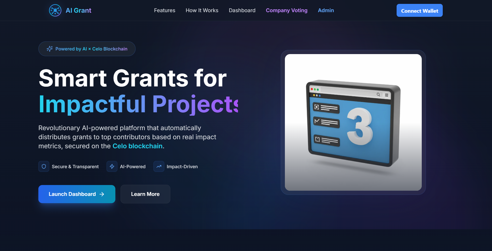
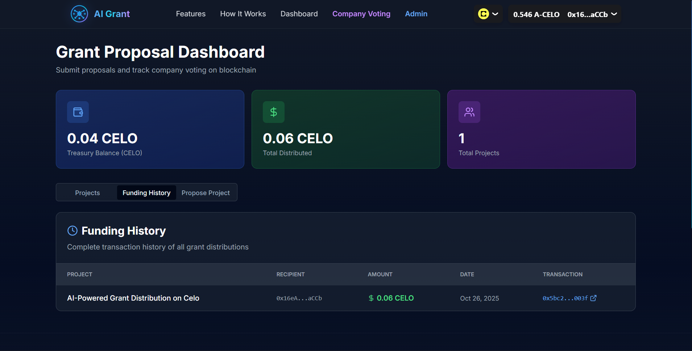
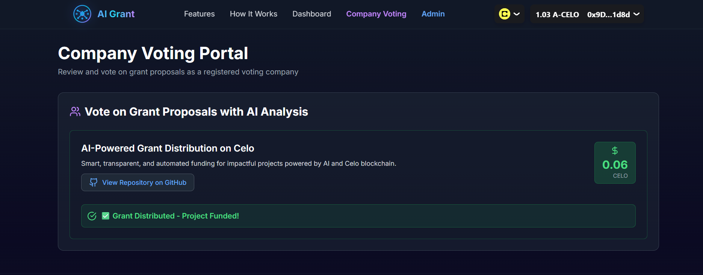
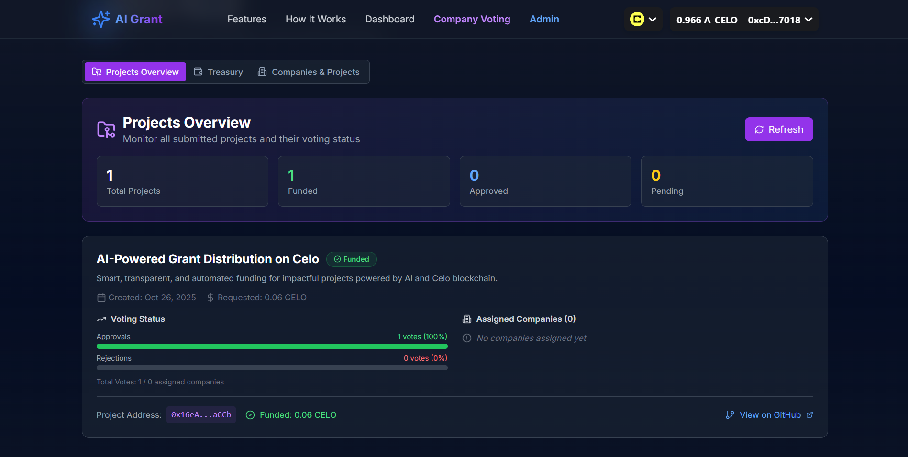

#  AI-Powered Grant Distribution on Celo - Ai Grant

A decentralized platform that combines artificial intelligence with blockchain technology to revolutionize how grants are distributed to impactful projects. Built on Celo blockchain for accessibility, transparency, and fairness.

## 🔗 Quick Links

**🌐 Live Demo:** [https://ai-grant-nine.vercel.app/](https://ai-grant-nine.vercel.app/)

**🎥 Video Demo:** [https://youtu.be/pcZ6CAegM8I](https://youtu.be/pcZ6CAegM8I)

**📜 Smart Contract:** [0x0243FD476b211BC4FB086f33876Af847868fdDd7](https://alfajores.celoscan.io/address/0x0243FD476b211BC4FB086f33876Af847868fdDd7) (Celo Alfajores)



---

## Table of Contents

- [About the Project](#about-the-project)
- [Key Features](#key-features)
- [How It Works](#how-it-works)
- [Technology Stack](#technology-stack)
- [Smart Contract](#smart-contract)
- [Screenshots](#screenshots)
- [Getting Started](#getting-started)
- [Project Structure](#project-structure)
- [Contributing](#contributing)

---

## About the Project

This platform addresses a critical challenge in the blockchain ecosystem: fair and transparent grant distribution. Traditional grant processes are often opaque, time-consuming, and subject to bias. Our solution leverages AI to analyze projects objectively based on real metrics while using Celo's blockchain to ensure complete transparency and automated execution.

The system evaluates projects through multiple dimensions including code quality, community engagement, sustainability, and impact potential. Registered companies vote on proposals, and when consensus is reached, grants are automatically distributed through smart contracts.

**Live Contract Address (Celo Alfajores Testnet):**
```
0x0243FD476b211BC4FB086f33876Af847868fdDd7
```

[View on Celo Explorer](https://alfajores.celoscan.io/address/0x0243FD476b211BC4FB086f33876Af847868fdDd7)

---

## Key Features

**For Project Owners:**
- Submit grant proposals with GitHub integration
- Real-time AI analysis of project metrics
- Track voting progress and funding status
- View complete funding history
- Receive grants directly to wallet

**For Companies/Voters:**
- AI-assisted project evaluation
- Detailed scoring across multiple criteria
- Transparent voting on blockchain
- Track assigned projects
- Review voting history

**For Administrators:**
- Manage treasury funds (CELO deposits)
- Register and assign companies to projects
- Monitor all project submissions
- View comprehensive analytics
- Configure AI scoring parameters

**Platform-Wide:**
- Native CELO token support (no stablecoins needed)
- Mobile-friendly responsive design
- Real-time blockchain synchronization
- Complete transparency of all transactions
- Secure wallet integration via RainbowKit

---

## How It Works

### 1. Project Submission
Projects connect their wallet and submit proposals with details including:
- Project name and description
- GitHub repository URL
- Requested grant amount

The system automatically fetches GitHub metrics including commits, stars, forks, issues resolved, and contributor activity.

### 2. AI Analysis
Our AI analyzes projects across five key dimensions:

- **Code Quality (0-25 points)**: Analyzes commit frequency, code structure, and development activity
- **Community Engagement (0-20 points)**: Evaluates stars, forks, and contributor participation
- **Sustainability (0-20 points)**: Assesses long-term viability and maintenance patterns
- **Impact Potential (0-15 points)**: Measures potential ecosystem contribution
- **Innovation (0-20 points)**: Reviews uniqueness and technical advancement

Total impact score ranges from 0-100, providing objective project assessment.

### 3. Company Assignment & Voting
Administrators assign projects to registered companies for review. Companies can:
- View AI-generated analysis and scores
- Review detailed project breakdowns
- Cast votes (Approve/Reject) on blockchain
- Track their voting history

### 4. Automated Grant Distribution
When a project receives majority approval (3 out of 5 company votes), the smart contract automatically:
- Transfers the requested CELO amount from treasury
- Records the transaction on blockchain
- Updates project funding status
- Adds to public funding history

All steps are transparent and verifiable on the Celo blockchain.

---

## Technology Stack

**Blockchain & Smart Contracts:**
- Solidity 0.8.20
- Hardhat development environment
- Celo blockchain (Alfajores testnet)
- OpenZeppelin contracts for security

**Frontend:**
- Next.js 14 (React framework)
- TypeScript for type safety
- Tailwind CSS for styling
- Framer Motion for animations

**Web3 Integration:**
- RainbowKit for wallet connection
- wagmi hooks for contract interaction
- viem for Ethereum utilities

**AI & Data:**
- Google Gemini API for project analysis
- GitHub API for repository metrics
- Real-time data processing

**Infrastructure:**
- Vercel for deployment
- Environment-based configuration
- Responsive mobile-first design

---

## Smart Contract

**Contract Name:** GrantDistributionCELO  
**Network:** Celo Alfajores Testnet  
**Address:** `0x0243FD476b211BC4FB086f33876Af847868fdDd7`

### Key Functions:

**Project Management:**
- `proposeProject()` - Submit new grant proposals
- `getProject(uint256)` - Retrieve project details
- `projectCount()` - Get total number of projects

**Voting System:**
- `vote(uint256, bool)` - Cast vote on assigned project
- `getProjectAssignedCompanies(uint256)` - View assigned voters
- `hasVoted(uint256, address)` - Check if company voted

**Treasury:**
- `depositToTreasury()` - Add CELO to grant pool (payable)
- `getTreasuryBalance()` - View available funds
- `distributeGrant(uint256)` - Execute approved grant distribution

**Administration:**
- `registerCompany(address, string)` - Register voting companies
- `assignProjectToCompany(uint256, address)` - Assign projects to voters
- `setMajorityThreshold(uint256)` - Configure voting threshold

### Events:
- `ProjectProposed` - New project submitted
- `VoteCast` - Company voted on project
- `ProjectApproved` - Project reached voting threshold
- `GrantDistributed` - Funds transferred to project
- `TreasuryDeposit` - Funds added to treasury

---

## Screenshots

### Landing Page

*Modern landing page with animated 3D background and clear call-to-action*

### User Dashboard

*Project owners can submit proposals, track voting status, and view funding history*

### Voting Panel (Company View)

*Companies review AI analysis and cast votes on assigned projects*

### Admin Dashboard

*Administrators manage treasury, register companies, and monitor all activities*

---

## Getting Started

### Prerequisites

Before you begin, ensure you have:
- Node.js 18.0 or higher installed
- A Celo-compatible wallet (MetaMask, Valora, etc.)
- Testnet CELO tokens from [Celo Faucet](https://faucet.celo.org/alfajores)

### Installation

1. Clone the repository:
```bash
git clone https://github.com/Sumanpradhan1706/AI-Powered-Grant-Distribution-on-Celo.git
cd AI-Powered-Grant-Distribution-on-Celo
```

2. Install dependencies:
```bash
npm install
```

3. Create environment file:
```bash
cp .env.example .env.local
```

4. Configure your `.env.local` file:
```env
# Google Gemini API (Free tier available)
GEMINI_API_KEY=your_gemini_api_key

# GitHub API Token (for repository analysis)
GITHUB_TOKEN=your_github_token

# Celo Configuration
NEXT_PUBLIC_CELO_NETWORK=alfajores
NEXT_PUBLIC_CONTRACT_ADDRESS=0x0243FD476b211BC4FB086f33876Af847868fdDd7

# WalletConnect Project ID
NEXT_PUBLIC_WALLETCONNECT_PROJECT_ID=your_project_id

# Admin wallet address
NEXT_PUBLIC_OWNER_ADDRESS=your_admin_wallet_address
```

### Running the Application

Development mode:
```bash
npm run dev
```

Production build:
```bash
npm run build
npm start
```

Access the application at `http://localhost:3000`

### Deploying Smart Contracts (Optional)

If you want to deploy your own contract:

1. Add your private key to `.env.local`:
```env
PRIVATE_KEY=your_wallet_private_key
```

2. Compile contracts:
```bash
npx hardhat compile
```

3. Deploy to Alfajores testnet:
```bash
npx hardhat run scripts/deployCELO.ts --network alfajores
```

4. Update `NEXT_PUBLIC_CONTRACT_ADDRESS` with your new contract address

---

## Project Structure

```
AI-Powered-Grant-Distribution-on-Celo/
├── app/                          # Next.js app directory
│   ├── api/                      # API routes
│   │   ├── ai/score/            # AI scoring endpoint
│   │   ├── contract/            # Contract interaction APIs
│   │   └── github/              # GitHub data fetching
│   ├── admin/                   # Admin dashboard page
│   ├── company/                 # Company voting page
│   ├── dashboard/               # User dashboard page
│   └── layout.tsx               # Root layout
├── components/                   # React components
│   ├── admin/                   # Admin panel components
│   ├── company/                 # Voting components
│   ├── dashboard/               # User dashboard components
│   └── landing/                 # Landing page components
├── contracts/                    # Solidity smart contracts
│   └── GrantDistributionCELO.sol
├── scripts/                      # Deployment scripts
│   └── deployCELO.ts
├── public/                       # Static assets
│   ├── Hero.png
│   ├── User.png
│   ├── Voting.png
│   ├── Admin1.png
│   └── logo.svg
├── lib/                         # Utility libraries
├── hardhat.config.ts            # Hardhat configuration
├── next.config.js               # Next.js configuration
└── package.json                 # Dependencies
```

---

## Contributing

We welcome contributions from the community! Here's how you can help:

1. Fork the repository
2. Create a feature branch (`git checkout -b feature/amazing-feature`)
3. Commit your changes (`git commit -m 'Add amazing feature'`)
4. Push to the branch (`git push origin feature/amazing-feature`)
5. Open a Pull Request

Please ensure your code follows the existing style and includes appropriate tests.

---

## Contact & Support

- **Repository:** [GitHub](https://github.com/Sumanpradhan1706/AI-Powered-Grant-Distribution-on-Celo)
- **Issues:** Report bugs or request features through GitHub Issues
- **Contract Address:** `0x0243FD476b211BC4FB086f33876Af847868fdDd7`

---

## Acknowledgments

- Built on [Celo](https://celo.org) blockchain for mobile-first accessibility
- Powered by [Google Gemini](https://ai.google.dev) for AI analysis
- UI components inspired by modern Web3 design patterns
- Special thanks to the Celo community for support and resources

---

**Note:** This platform is currently deployed on Celo Alfajores testnet for testing purposes. Always use testnet tokens and never share private keys or sensitive information.

5. **Deploy contracts to Alfajores testnet**
```bash
npm run deploy
```

Copy the contract address from the output and add it to your `.env` file as `NEXT_PUBLIC_CONTRACT_ADDRESS`.

6. **Set up Supabase database**

Run these SQL commands in your Supabase SQL editor:

```sql
-- Create projects table
CREATE TABLE projects (
  id BIGSERIAL PRIMARY KEY,
  project_address TEXT NOT NULL,
  name TEXT NOT NULL,
  description TEXT,
  github_url TEXT NOT NULL,
  impact_score INTEGER DEFAULT 0,
  total_grants_received NUMERIC DEFAULT 0,
  is_active BOOLEAN DEFAULT true,
  is_verified BOOLEAN DEFAULT false,
  created_at TIMESTAMP DEFAULT NOW(),
  updated_at TIMESTAMP DEFAULT NOW()
);

-- Create impact_scores table
CREATE TABLE impact_scores (
  id BIGSERIAL PRIMARY KEY,
  project_id BIGINT REFERENCES projects(id),
  score INTEGER NOT NULL,
  github_activity INTEGER,
  community_engagement INTEGER,
  milestones_completed INTEGER,
  ai_analysis JSONB,
  calculated_at TIMESTAMP DEFAULT NOW()
);

-- Create grant_distributions table
CREATE TABLE grant_distributions (
  id BIGSERIAL PRIMARY KEY,
  project_id BIGINT REFERENCES projects(id),
  amount TEXT NOT NULL,
  token_address TEXT NOT NULL,
  transaction_hash TEXT NOT NULL,
  reason TEXT,
  distributed_at TIMESTAMP DEFAULT NOW()
);

-- Create indexes
CREATE INDEX idx_projects_address ON projects(project_address);
CREATE INDEX idx_projects_score ON projects(impact_score DESC);
CREATE INDEX idx_grants_project ON grant_distributions(project_id);
```

7. **Run the development server**
```bash
npm run dev
```

Open [http://localhost:3000](http://localhost:3000) in your browser.

---

## Contact & Support

- **Repository:** [GitHub](https://github.com/Sumanpradhan1706/AI-Powered-Grant-Distribution-on-Celo)
- **Issues:** Report bugs or request features through GitHub Issues
- **Contract Address:** `0x0243FD476b211BC4FB086f33876Af847868fdDd7`

---

## Acknowledgments

- Built on [Celo](https://celo.org) blockchain for mobile-first accessibility
- Powered by [Google Gemini](https://ai.google.dev) for AI analysis
- UI components inspired by modern Web3 design patterns
- Special thanks to the Celo community for support and resources

---

**Note:** This platform is currently deployed on Celo Alfajores testnet for testing purposes. Always use testnet tokens and never share private keys or sensitive information.
